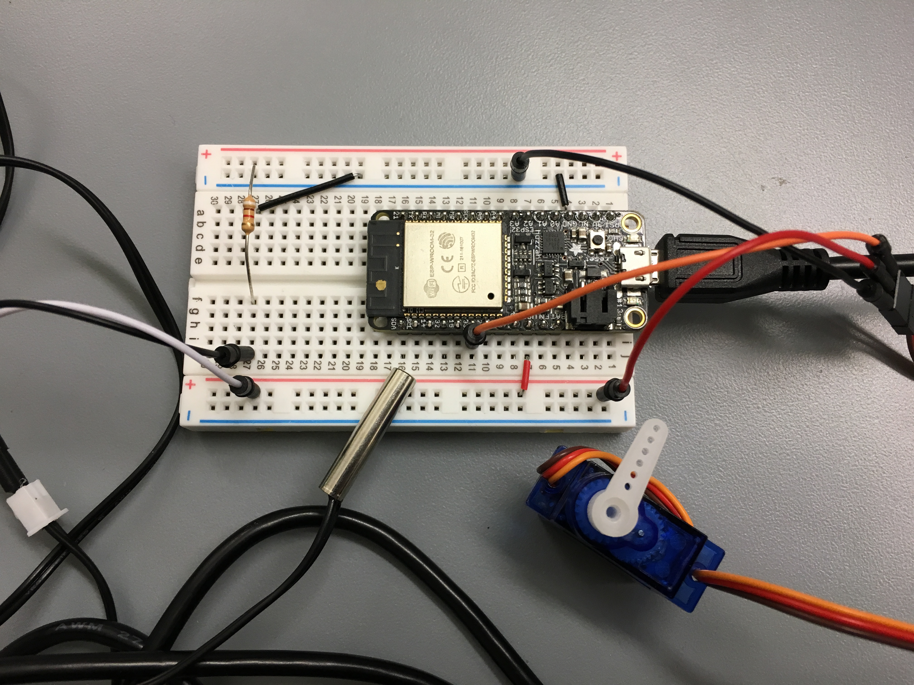
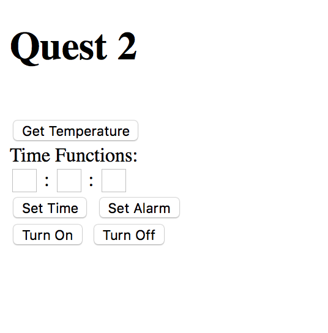

# Quest #3: Online Appliance 30/10/2018

Author: Mahdiul Chowdhury, Carlos Callejas, Devin Chen

## Summary

NodeJs Server:

This was hosted locally on a laptop connected to the router network. In addition to the main index html file it also had a local js file which handled all of the GET and POST requests using jQuery. 

HTTP Server: 

Each received HTTP request has an associated URI, and a handler as specified by its URI. The handler executes and returns a value (in the case of a GET request) or performs data manipulation (in the case of a POST request). With get requests there was an issue with the allow-access-control-origin header, since it was getting a request from the same ip but different port. So in the http server code, whenever it made a get requests, I sent a custom header to allow the access control origin from all origins. 

Thermistor: 

Once we set up the ADC's attenuation and Vref appropriately, we calibrated the Thermistor using two points (assuming room temperature is 21C and the human body's surface temperature is 34C), from there we approximated the Resistance vs. Temperature curve using a (decaying) exponential. Using the curve and some voltage divider math, we can get fairly accurate readings for temperature, which are returned to the temp_get handler for display in our website front-end.

Servo: 

The servo was used to emulate a on and off switch which could be manually controlled through the client website or be activated through a time based alarm. The fields on the website sent a post request which then was parsed by the esp into hours, minutes and seconds

RPI and Camera: 

Using Rasbian light stretch we setup the webcam. First we configured all the settings in raspberry pi and then installed all the software packages. We installed motion, and cofigured the motion config file to live stream using IP address. We port forwarded using the port id 8081. 

## Sketches and Photos

Wiring and setup

Client webpage

## Modules, Tools, Source Used in Solution

Esp-idf examples:
* ADC1
* MCPWM
* HTTP Server

C Libraries (not in examples):
* <math.h>

## Supporting Artifacts

- [Demo](https://drive.google.com/open?id=1_PBIaSQ6e9s_q7wSC2fgRkHQcQhHi-Qz)

Reminders
Please remember to post a link to this report.md file on Piazza
Repo is private
